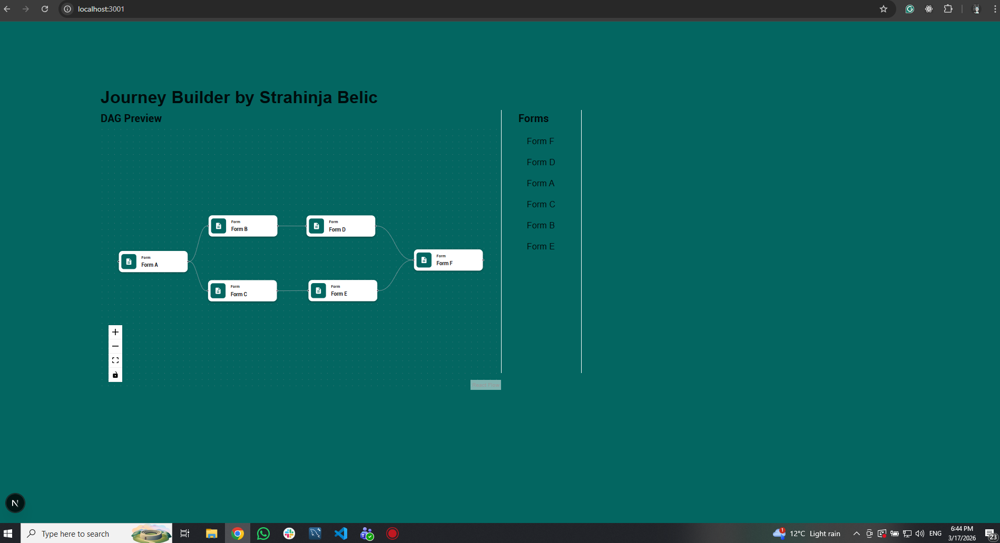
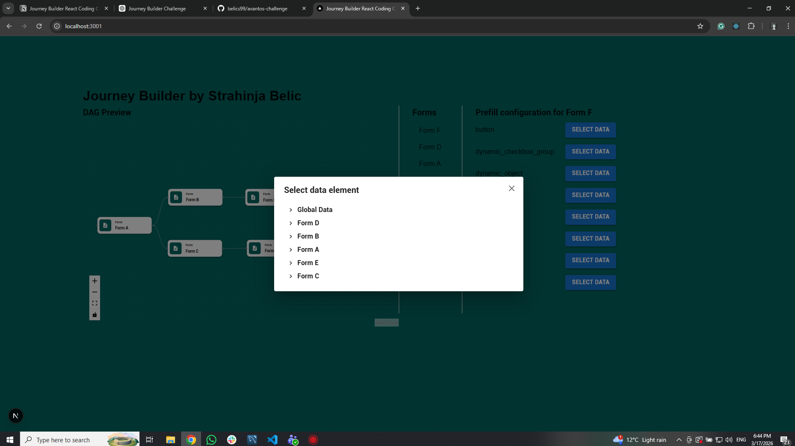
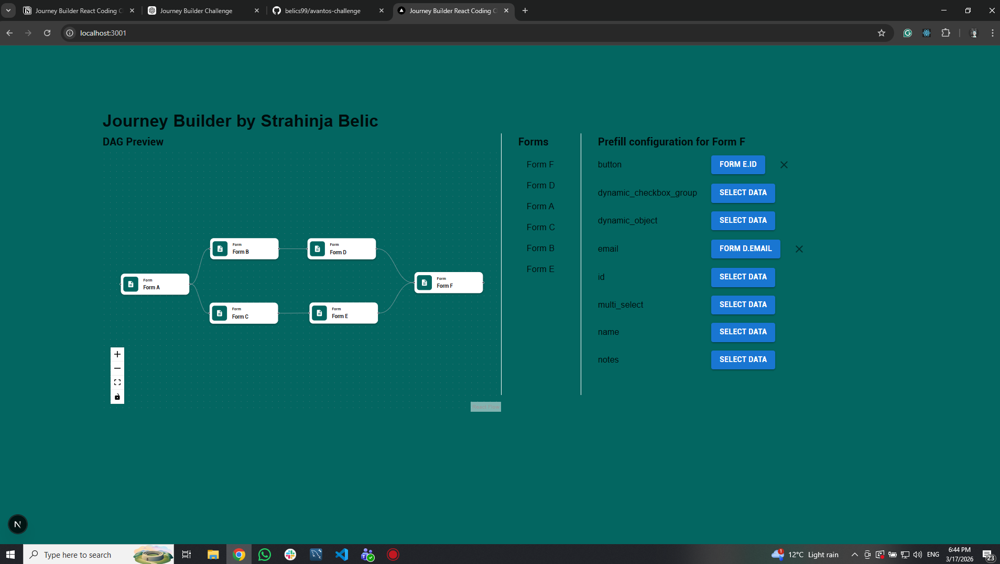

# Journey Builder – React Coding Challenge

This project is a simplified implementation of a node-based Journey Builder UI, inspired by Avantos' internal tooling.

It allows users to:

- Visualize a graph of forms (DAG)
- Inspect forms and their fields
- Configure prefill mappings between upstream and downstream forms
- Extend data sources for prefill in a scalable way

## Preview

- 
- 
- 

## Tech Stack

- Next.js
- React
- TypeScript
- Material UI (MUI)
- React Flow (for DAG visualization)
- Zustand (state management)

## Getting Started

1. Clone the repository
   git clone https://github.com/belics99/avantos-challenge.git
   cd avantos-challenge
2. Install dependencies
   npm install
3. Run mock server
   git clone https://github.com/mosaic-avantos/frontendchallengeserver.git
   cd frontendchallengeserver
   npm install
   npm start

Mock server runs on:
http://localhost:3000

4. Run the app
   npm run dev

App runs on:
http://localhost:3001

## Architecture Overview

### Graph Rendering

Graph data is fetched from:

/api/v1/:tenantId/actions/blueprints/:actionBlueprintId/graph

- Rendered using React Flow
- Each node represents a Form

### Prefill Mapping System

Prefill mappings are stored in a normalized structure:

```
export type TPrefillStoreMapping = Record<
  string,
  Record<string, IPrefillMapping>
>;

export interface IPrefillStore {
  mappings: TPrefillStoreMapping;
  setMapping: (
    formId: string,
    fieldId: string,
    mapping: IPrefillMapping,
  ) => void;
  clearMapping: (formId: string, fieldId: string) => void;
}

```

### Component Structure

```
/app
  /page.tsx

/components
  /FormGraph
  /FormList
  /FormNode
  /FormPrefillEditor
  /PrefillFieldRow
  /DataSelectorModal
  ...

/store
  /usePrefillStore.ts

/services
  /graphService.ts

/utils
  /getFormFields.ts
  /getUpstreamForms.ts
  /buildFormDefinitionMap.ts
```

### Extensible Data Sources

Prefill data sources are designed to be pluggable:

```
export interface IDataSource {
  id: string;
  label: string;
  getFields(): {
    id: string;
    label: string;
  }[];
}

```

Examples:

- Form fields (direct)
- Form fields (transitive)
- Global data
- <i>New sources can be added without changing UI logic.</i>

## Testing

- Jest
- React Testing Library

```
    npm run test
```

## Demo

Include a 20min. screen recording here:

https://we.tl/t-NOFJdHLnep

## Notes

Used docs:

- https://fluttering-atmosphere-1b5.notion.site/Journey-Builder-React-Coding-Challenge-190d5fe264fa80cba39ec21afc6d42ec
- https://admin-ui.dev-sandbox.workload.avantos-ai.net/docs#/operations/action-blueprint-graph-get
- https://mui.com/material-ui/all-components/
- https://www.npmjs.com/package/zustand
- https://www.npmjs.com/package/reactflow
- https://nextjs.org/docs

Used LLM:

- ChatGPT

## Author

Strahinja Belic
